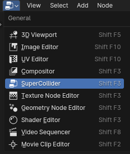
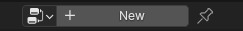

# SuperColliderBlender

## AIM:
* Visual approach to supercollider

## How to:
1. Open Blender and go to the scripting tab
2. Open and run the 2 python scripts
3. There should now be a new Editor Type called "SuperCollider"

4. Create a new Node tree

5. Add your nodes, final node should always be the Output node

6. Within the N-Panel a new tab should be present called "SCD"
7. Click the "Run" button and choose where you want the supercollider file to be.

8. Type the name (end it with .scd) and click "Iterate Node."
9. Open supercollider and open the file created.
10. Boot supercollider server and run code.

